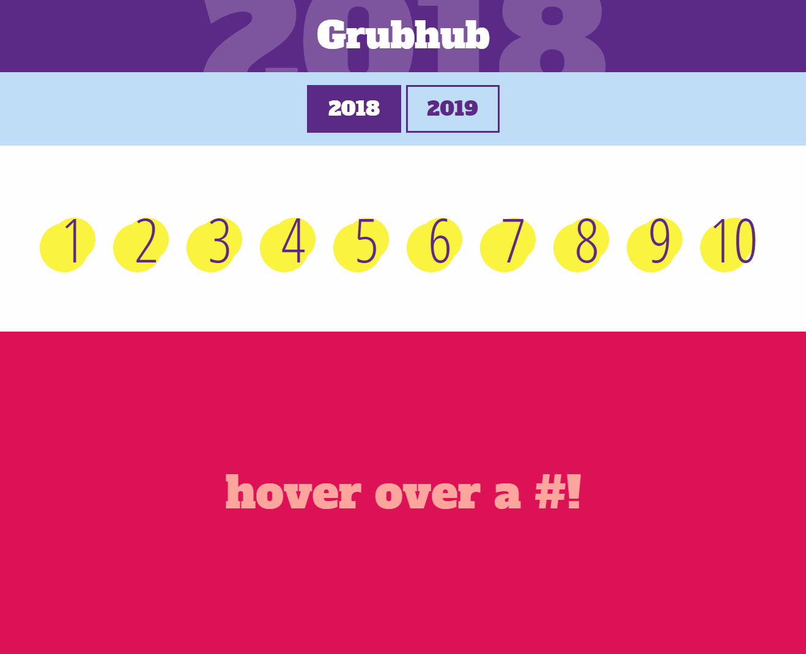

# Consolidation

## 🦊 Pre-lecture

There is no pre-lecture for this workshop.

---

## 🦉 Lecture

- [Lecture 1 | Sort](./lecture/lecture-1-sort.md)
- There will be a group Tic Tac Toe demo, you can find the files in the `lecture/activity` folder.

---

## Setup

```
yarn install
```

---

## ⚡ Exercise-1

Build fun web page that renders GrubHub's top ten food for [2018](https://www.insider.com/most-popular-foods-grubhub-2018-12) and [2019](https://www.thepacker.com/article/report-grubhubs-2019-year-food)!

This is what it will look like if you 100% complete this workshop



The lists of foods are provided in `assets/topTenList.js`.

```js
const topTenList = {
  2018: [
    { id: "1", name: "bean burritos" },
    { id: "2", name: "poke bowl" },
    { id: "3", name: "chicken sliders" },
    { id: "4", name: "pork baby back ribs" },
    { id: "5", name: "chicken burritos" },
    { id: "6", name: "chicken sandwich" },
    { id: "7", name: "cauliflower rice bowl" },
    { id: "8", name: "chicken and waffle sliders" },
    { id: "9", name: "parmesan chicken" },
    { id: "10", name: "buffalo-flavored cauliflower" },
  ],
  2019: [
    { id: "1", name: "cauliflower pizza" },
    { id: "2", name: "spicy brussel sprouts" },
    { id: "3", name: "portobello empanada" },
    { id: "4", name: "black bean & sweet potato taco" },
    { id: "5", name: "miso pork ramen" },
    { id: "6", name: "chicken burger" },
    { id: "7", name: "bone broth" },
    { id: "8", name: "brown sugar (bubble) tea" },
    { id: "9", name: "vegan pad thai" },
    { id: "10", name: "impossible burger" },
  ],
};
```

_It has already been added to the HTML file, so it will be available for use in your `scripts.js` file._

---

### CSS

All of the CSS has been provided for you. Adding the right class to the right HTML element will get you the desired outcome, but it was done by a particularly _evil_ developer. The class names are non-sensical 🤦‍♂️ and won't help you. You'll have to do some detective work.

**You are not allowed to modify any of the provided CSS properties, but you are definitely encouraged to add comments above the class names to make them more understandable.**

---

### **Step 1**

Complete the basic structure of the page in the index.html file in /workshop/exercise-1

### **Step 2**

Look at the css file provided to you in /workshop/exercise-1/assets/css/styles.css

Add class name attributes to your html to get it appearing like gif at the top of the Exercises section.

Remember, you are NOT allowed to edit the css rules in this file!

### **Step 3**


Edit the scripts.js file to gain the desired functionality of the top two buttons.

Make sure that when a year is selected, both the button is colored in and the year in the header is updated.

Note that 2018 should be selected when the page first loads.

---

<center>🟡 - Minimally complete workshop (75%) - 🟡</center>

---

### Completion Requirements

1. To view each top ten item, the user has to hover over the numbers in the white area.
2. If the user's mouse is not over one of the numbers, the bottom section should say "hover over a #!"
3. The end result should look _exactly_ like the provided mockup.
4. You are not allowed to modify any of the CSS properties.
5. In light of the horrible classnames, please add `id`s to the HTML elements and use `.getElementById()` for this exercise. _This is to ensure that the CSS and JS don't interfere with each other._


---

<center>🟢 - Complete workshop (100%) - 🟢</center>

---

## Stretch goals

- Improve/add functionality to the page!
